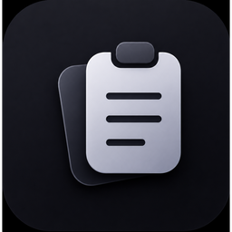

<p align="center">
  
</p>

<h1 align="center">Carbon</h1>

<p align="center">
  <strong>A fast, local-first clipboard manager for Windows.</strong><br/>
  Overlay, searchable history, collections, snippets & OCR — everything stays on your machine.
</p>

<p align="center">
  <a href="https://github.com/sanirudh17/Carbon/releases/latest"></a>
  <a href="./LICENSE"></a>
  
  <a href="https://v2.tauri.app/"></a>
</p>

---

## Overview

Carbon is a local-first clipboard manager for Windows. Press a hotkey to summon an overlay anywhere, paste from a searchable history, organize clips into collections, expand snippets system-wide, and extract text from images with bundled Tesseract OCR — all without cloud, accounts, or telemetry.

Everything lives in a local SQLite database (`carbon_history.db`) with image files on disk in `%APPDATA%\com.carbon.clipboard\`. History, snippets, and settings never leave your computer.

> **New here?** Install the single `Carbon_0.1.2_x64-setup.exe` from [Releases](https://github.com/sanirudh17/Carbon/releases/latest) — no extra dependencies, Tesseract is already bundled.

## Contents

- [Features](#features)
- [How It Works](#how-it-works)
- [Settings Reference](#settings-reference)
- [Download & Install](#download--install)
- [Building from Source](#building-from-source)
- [Tech Stack](#tech-stack)
- [Project Structure](#project-structure)
- [Configuration & Data](#configuration--data)
- [Privacy](#privacy)
- [Troubleshooting](#troubleshooting)
- [License](#license)

## Features

**Capture & History**

- **Automatic capture** of text, code, rich text, images, files, links, email, and color values as you copy — with de-duplication and pinning.
- **Searchable history** with type filters, full-text search, and inline editing of clip text.
- **Collections** with colors and optional PIN + recovery code; add/remove clips, rename, and color-code.
- **Bulk actions** — select many clips to pin, delete, or queue for pasting.

**Overlay & Library**

- **Quick overlay** (`Ctrl+Shift+Z`) — centered at the cursor, shows recent clips and snippets. Filter by type, queue multiple clips with `Ctrl+V` to advance, and paste with transforms (plain text, markdown, JSON, uppercase/lowercase/title, base64, URL encode/decode). Preview pane is toggleable.
- **Full library** (`Ctrl+Alt+X`) — searchable, sortable view of all history with collections sidebar, stats, and snippet management.

**Snippets & Expansion**

- Create snippets with keywords (e.g. `/date`) and dynamic placeholders (`{date}`, `{time}`, `{clipboard}`, `{cursor}`).
- **System-wide expansion** — type a keyword in any app and it expands inline at native typing speed. Private 256-char in-memory buffer, zero CPU when idle, UIPI-safe in elevated windows. Opt-in via consent.

**Image & Text Tools**

- **OCR** — extract text from any image clip with one click. Preprocessing upscales 3×, enhances contrast, adds white padding, and runs two Tesseract PSM passes (`6` then `3` fallback); `eng.traineddata` ships inside the installer.
- **Transforms on paste** — choose per-paste or set default plain-text pasting and move-to-top behavior.

**Smart Capture**

- **ClipMerge** — rapid successive copies within a window append to the top clip instead of creating separate entries.
- **URL cleaning** — strip tracking params (`utm_*`, `fbclid`, `gclid`, etc.) at capture time.
- **Custom rules** — ordered find/replace (plain text or regex) applied on every capture.
- **Sensitive detection** — optional local detection of credit cards (Luhn), API keys, JWTs, and private keys, with auto-expiry after 5 minutes.

**Hotkeys & Theming**

- Two swappable global shortcuts with atomic `unregister_all`/`reapply` and strict rollback. `Ctrl+Alt` handled via `AltGraph` parity and a `WH_KEYBOARD_LL` hook so GPU software can't steal focus; conflicts show inline errors and toast pop-ups.
- **Dark/light themes** with PNG badge at native resolution (1.2–1.3 MB dark/light) and 6 accent swatches + custom picker. All settings persist in `settings.json`.

## How It Works

Everything between copying and pasting runs as a local pipeline. Each stage can fail without losing your clipboard.

```
  copy (Ctrl+C / right-click)
        │
        ▼
  clipboard watcher ───────► classify (text/code/image/file/link/email/color/rich)
        │                    de-duplicate, apply ClipMerge window
        ▼
  smart capture ───────────► strip tracking params → custom rules (regex/text, ordered)
        │                    detect sensitive → set expires_at (+5m) if enabled
        ▼
  storage ─────────────────► SQLite (WAL) + image files in %APPDATA%\com.carbon.clipboard%\media
        │                    trim by retention_days / max_entries (hourly + on save)
        ▼
  overlay / library ───────► search, filter, pin, edit, queue, transform
        │
        ▼
  paste ───────────────────► paste_clip / queue_paste_next with PasteTransform
                             (plain/markdown/json/case/base64/url) + bump-to-top
```

**Snippets** run on a separate `WH_KEYBOARD_LL` path: keystrokes are buffered, matched against a trie of keywords, and replaced inline via `write_text_to_clipboard` + `paste_text_into_target` with `{cursor}` support.

## Settings Reference

**Behavior** — `Overlay opens on` (Clips/Snippets) · `Keep window warm` (hide vs close, recreate when cold) · `Start with Windows` (Run registry) · `ClipMerge` + `ClipMerge window` (500–10000 ms, debounced).

**Snippets** — `Enable snippet expansion` (consent-gated, `WH_KEYBOARD_LL`) · `Show snippets in library & overlay`.

**Capture Rules & Sanitization** — `Strip URL tracking parameters` · `Custom Find & Replace Rules` (plain/regex, enabled toggle, ordered).

**Privacy** — `Detect and auto-expire sensitive clips`.

**Storage** — `Retention` (days, `0` = forever) · `Max entries` · `Image size limit` (`0` = unlimited, MB) · `Clear history` (deletes DB rows + orphan images + emits update) · `Export`/`Restore` backup (JSON with base64 images, snippets).

**Appearance** — `Accent theme` (6 swatches + custom `<input type=color>`) · `Theme mode` (dark/light, `html[data-theme]`).

Internals: `overlay_default_tab`, `preview_enabled`, `detect_sensitive_data`, `clip_merge_enabled`, `clip_merge_window_ms`, `strip_tracking_params`, `capture_rules`, `snippet_expansion_enabled`, `show_snippets` all in `AppSettings` (`settings.rs`).

## Download & Install

Download the latest installer from the [**Releases**](https://github.com/sanirudh17/Carbon/releases/latest) page and run it:

| Installer | Notes |
|---|---|
| **`Carbon_0.1.2_x64-setup.exe`** | NSIS installer — single executable, bundles Tesseract OCR. Recommended. |

Everything Carbon needs is bundled — no extra dependencies. The installer is currently unsigned, so Windows SmartScreen may show *“Windows protected your PC”* → **More info → Run anyway**.

**System requirements:** Windows 10 or 11 (64-bit). WebView2 is preinstalled on Windows 11 and auto-installed on Windows 10 if missing.

## Building from Source

### Prerequisites

- [Node.js](https://nodejs.org/) 18+ with npm
- [Rust](https://rustup.rs/) stable toolchain
- [Tauri v2 prerequisites](https://v2.tauri.app/start/prerequisites/) — Microsoft C++ Build Tools + WebView2
- PowerShell (for binary fetch)

### 1. Clone and install

```bash
git clone https://github.com/sanirudh17/Carbon.git
cd Carbon
npm install
```

### 2. Fetch the bundled OCR runtime

Tesseract is large (~164 MB) and not committed. Fetch once per machine:

```powershell
# Fetch tesseract to src-tauri/binaries/tesseract/ (tesseract.exe, DLLs, tessdata/eng.traineddata)
# Use your preferred fetch script or copy from an existing local build
```

This populates `src-tauri/binaries/tesseract/` (`tesseract.exe`, DLLs, `tessdata/eng.traineddata`) which `npm run tauri build` bundles via `tauri.conf.json` `bundle.resources: {"binaries/tesseract":"tesseract"}`. Without it the app builds but OCR will report `TESS_MISSING`.

### 3. Run in development

```bash
npm run tauri dev
```

### 4. Build the single executable

```bash
npm run tauri build
# → src-tauri/target/release/bundle/nsis/Carbon_0.1.2_x64-setup.exe
```

### 5. Run the test suite

```bash
cargo test --manifest-path src-tauri/Cargo.toml
npm run build
```

## Tech Stack

| Layer | Technology |
|---|---|
| App shell | [Tauri v2](https://v2.tauri.app/) — Rust core + WebView2 |
| Frontend | React 19, TypeScript, Vite, Zustand |
| Database | SQLite (`rusqlite` bundled, WAL) |
| OCR | Tesseract 5 (`eng.traineddata` bundled) |
| Hotkeys | `tauri-plugin-global-shortcut` + `WH_KEYBOARD_LL` hook |
| Clipboard | Windows `Win32_System_DataExchange`, `html2md`, `image` |

## Project Structure

```
src/               React + TypeScript frontend (Vite)
  components/      QuickOverlay, EnlargedWindow, Settings, Icons (PNG badge)
  assets/          carbon-badge-dark/light.png (1.2–1.3 MB, theme-aware)
src-tauri/
  src/             Rust core (clipboard_watcher, db, hotkey, shortcuts, expansion, ocr, paste, history, settings)
  icons/           Generated from dark PNG (128x128@2x, icon.ico/icns, StoreLogo)
  binaries/tesseract/  Bundled OCR runtime (not committed, fetched per-machine)
```

## Configuration & Data

Settings, history, and snippets are stored as JSON/SQLite in your user config directory:

```
%APPDATA%\com.carbon.clipboard\
├── settings.json      # AppSettings (hotkeys, theme, retention, etc.)
├── carbon_history.db  # SQLite (clips, collections, snippets)
└── media/             # image files for image clips
```

Clipboard watcher and `HistoryManager` trim history hourly and on save according to `retention_days` (0 = keep forever) and `max_entries` (oldest unpinned first). `keep_window_warm` controls whether overlay/library `hide()` vs `close()` (free memory).

## Privacy

Carbon is **local-first**. No network code, no cloud sync, no accounts, no telemetry. Clipboard history, images, snippets, and settings live in `%APPDATA%\com.carbon.clipboard\` and never leave your disk. Snippet expansion uses a private 256-char in-memory buffer never written to disk; it is opt-in and `snippet_expansion_enabled` is excluded from backup/restore by design. Window titles are never logged for context detection.

## Troubleshooting

**Overlay doesn't appear with the hotkey.**
Another app may own that combo — Windows gives it to whoever registered first. Carbon keeps your previous hotkey and shows an inline error + toast. Try a different combo (`Ctrl+Shift+Z` is free by default).

**OCR says “Tesseract is not installed”.**
The `src-tauri/binaries/tesseract` folder is missing. Fetch it (see Building step 2) and rebuild, or install Tesseract via `winget install UB-Mannheim.TesseractOCR` for a system-wide fallback.

**Nothing happens when I paste.**
Check `Behavior → Keep window warm` and `Paste plain text` settings. If `move to top on paste` is on, the pasted clip bumps to the top of history.

**History grows forever or deletes too quickly.**
`Storage → Retention` (`0` = forever) and `Max entries` are enforced by `trim_history`; `Clear history` removes unpinned clips and orphan images.

## License

Released under the [MIT License](./LICENSE). © 2026 Sanirudh ([sanirudh17](https://github.com/sanirudh17)).

Bundled Tesseract is third-party software under [Apache-2.0](https://github.com/tesseract-ocr/tesseract) and remains under its own license. It is fetched per-machine and not part of this repository.

## Acknowledgements

Built with [Tauri](https://v2.tauri.app/) and [Tesseract OCR](https://github.com/tesseract-ocr/tesseract). Icon design from the Carbon layered-clipboard illustration.
